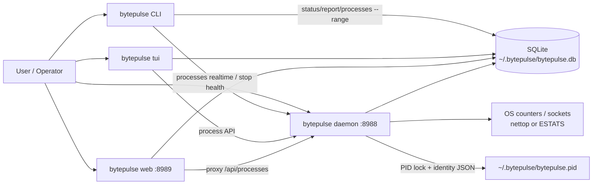
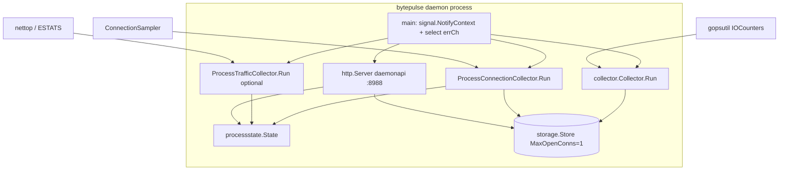
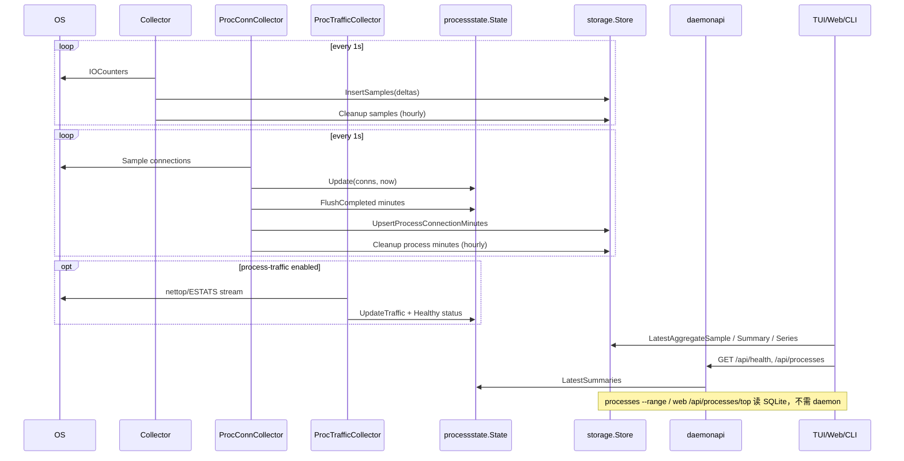
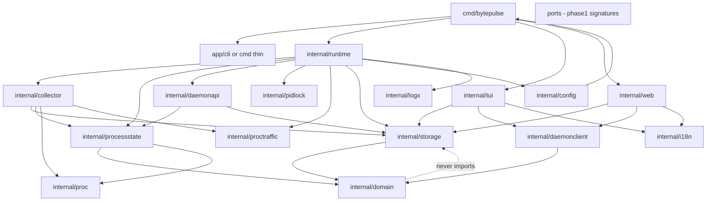
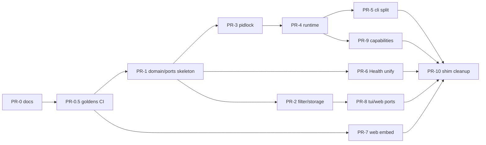
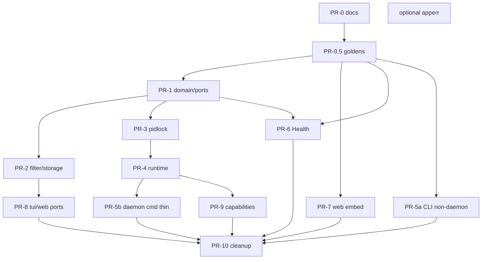

# BytePulse 架构设计文档（重构/重写蓝图）

| 字段 | 值 |
| --- | --- |
| **Title** | BytePulse Architecture Design — Refactor / Rewrite Blueprint |
| **Author** | — (placeholder) |
| **Date** | 2026-07-10 |
| **Status** | Draft |
| **Audience** | 熟悉本仓库的高级工程师 / maintainer |
| **Scope** | 产品现状（含 Phase 2 进程监控）→ 可维护性诊断 → 目标分层架构 → 增量迁移 PR 计划 |
| **Related** | `docs/superpowers/specs/2026-07-07-phase2-process-monitoring-design.md`；`docs/superpowers/plans/2026-07-10-review-findings-remediation.md`；`README.md`；`Claude.md` |

---

## Overview

BytePulse 是一个**本机、按需使用**的网络排障工具：需要看谁在吃带宽时打开，而不是 24×7 后台常驻产品。单二进制（Go 1.22 模块 `bytepulse`）通过 OS 计数器与平台 API 采样（**不做抓包**），用 SQLite 持久化网卡秒级样本与进程连接分钟聚合，并通过 **CLI / TUI (Bubbletea) / 本机 Web 看板** 展示实时速率与历史总量。支持平台上还提供联网进程列表与可选每进程 RX/TX（macOS `nettop`、Windows TCP ESTATS）。

当前树在 Phase 1 网卡监控与 Phase 2 进程监控快速落地后，功能基本齐全，但**装配、生命周期、展示、平台细节**大量堆在 `cmd/bytepulse` 与少数“胖包”中，类型与契约重复、注释/文档与代码漂移、包边界渗漏，使得后续改动风险高。本文档先精确刻画 **as-is**，再给出**不改变产品行为**的 **to-be** 分层与可执行的 strangler（绞杀者）式 PR 计划，作为后续重构或受控重写的蓝图。

---

## Background & Motivation

### 产品定位与硬约束（不可在重构中放松）

| 约束 | 说明 |
| --- | --- |
| 按需排障 | 非 always-on 服务；用户显式 `daemon` / `stop` |
| 单二进制 | 模块 `bytepulse`，Go 1.22 |
| 无抓包 | 仅 OS counters + 平台 API（`gopsutil`、`nettop`、ESTATS 等） |
| 三前端 | CLI、TUI、Web（内嵌 SPA） |
| 存储 | SQLite via `modernc.org/sqlite`（纯 Go、无 CGO）；WAL；`MaxOpenConns=1` |
| 单 collector | 仅一个 daemon：PID 文件排他锁 + API health + 实例身份 JSON |
| 查看器不自启 daemon | TUI/Web/CLI 等待或报错，并给出启动提示 |
| 配置优先级 | defaults &lt; YAML（`~/.bytepulse/config.yaml` 或 `--config`）&lt; CLI flags |
| i18n | UI `en`/`zh`；**日志永远英文**；`--help` 静态中英双语 |
| 平台矩阵 | macOS 全量；Windows 10+ 连接 + TCP ESTATS（无 UDP 字节）；Linux 目前仅 NIC |

### 当前状态（已实现能力摘要）

- **网卡路径**：`collector.Collector` 每秒差分 `gopsutil` IOCounters → `samples` 表；`status`/`report`/TUI/Web 读库。
- **进程连接路径**：`proc.ConnectionSampler` → `processstate.State` 内存实时态 + 分钟桶 → `process_connection_minutes`；daemon HTTP API 暴露实时；历史走 SQLite。
- **进程流量路径（可选）**：`proctraffic.Attributor`（darwin nettop / windows estats / other stub）→ `ProcessTrafficCollector` → 内存速率 + 3s TTL；失败则 `degraded`，**不杀 daemon**。
- **生命周期**：`acquireDaemonInstance` 排他锁 + API 健康拒绝双实例；`stop` 比对 PID 文件与 `/api/health` 的 `instance_id` 后再发信号。

### 痛点（为何难维护）

功能由 vibe-coding / 审查补丁层层叠加上去后，出现：

1. **入口与装配过重**：`cmd/bytepulse/main.go` ≈ 797 行，同时承担 Cobra 树、daemon 编排、stop 安全逻辑、进程表格渲染、历史查询等。
2. **胖包 / 资产内嵌**：`internal/web/web.go` ≈ 637 行，其中约一半为 `indexHTML` 字符串常量，HTML/CSS/JS 与 Go handler 同文件。
3. **契约重复**：`daemonapi.HealthResponse` 与 `daemonclient.HealthResponse` 结构体重复定义；`ProcessConnectionSummary` / `ProcessConnectionMinute` 在 `processstate` 与 `storage` 各一份。
4. **包边界渗漏**：`storage` 依赖 `proc`（`FilterSelfSummaries` / `IsSelfProcess`）；领域类型与过滤逻辑混在持久化层。
5. **文档漂移**：`Claude.md` 仍写 15 天保留与简化架构，代码默认 **30 天**（`config.Default` / collector），且未反映 Phase 2 包图。
6. **平台策略正确但分散**：`//go:build` 散落在 `proc/sampler_*.go`、`proctraffic/attributor_*.go`、PID lock 平台文件；缺少统一 capability 层。
7. **故障语义不对称**：网卡采样错误会令 collector 返回错误并可能拖垮 daemon 路径；进程流量失败被吞并置 `degraded` 且**无自动重试**（产品上可接受，但代码意图需显式化）。
8. **注释/产品文案与实现偶有不一致**：例如 remediation 计划中设想的 `Health` 委托、`Shutdown` 方法名等与最终代码略有偏差——阅读计划文档不能替代读代码。

这些不是“功能坏了”，而是**边界与单一真相源缺失**，使任何跨进程路径改动都需要在 CLI/TUI/Web/API/state/storage 多处同步。

---

## Goals & Non-Goals

### Goals（目标架构要达成）

1. **行为冻结兼容**：CLI flags、默认路径、SQLite schema、daemon API JSON 形状、单实例语义、daemon-down UX、web dual-path 与现状一致（允许内部重命名/拆包）。兼容面清单见 **Appendix C**；每个结构重构 PR 必须对照该清单并附测试证明。
2. **清晰边界（务实分层）**：优先消除 god-main / 双 DTO / fat web / 边界渗漏；目标态采用 ports 与（可选）`domain` 包。**允许**保留现有包名的“务实拆分”作为完整 hexagonal 重命名的中间态（见 Alternatives A5 / KD3）。禁止 UI 直接依赖平台实现内部类型。
3. **单一契约源**：`HealthResponse`、进程 API/历史 DTO 各只有一处权威定义。**`config.Config` 权威仍在 `internal/config`**（加载/YAML/flags），**不**搬入 domain。
4. **可测装配**：daemon 生命周期与 worker 图可在不启真网卡的情况下做单元/集成测试。
5. **可增量迁移**：优先 strangler；**结构 PR 禁止夹带行为修复**（行为修复单独 PR）。
6. **文档与代码对齐**：本设计为架构基线；`Claude.md` / Phase2 状态行 / remediation 计划状态在 PR-0/0b 纠偏。
7. **契约金样尽早入 CI**：可执行 golden（health/PID/schema/API shapes）在搬包 **之前** 落地（PR-0.5），而非全部重构之后。

### Non-Goals（本蓝图明确不做 / 重写阶段也不引入）

| 非目标 | 说明 |
| --- | --- |
| Linux 进程监控实现 | 仍 deferred；仅保留接口扩展点 |
| always-on 安装（launchd/systemd） | 可选未来工作，非本阶段 |
| 查看器 auto-start daemon | 明确禁止 |
| 抓包 / eBPF / Network Extension | 产品边界外 |
| 进程流量 backend 自动重试 | **显式 deferred optional**；当前 fail→degraded 保留 |
| 多租户 / 远程鉴权 / 云同步 | 本机工具 |
| 微服务拆分 / 多进程业务服务 | 拒绝（见 Alternatives） |
| 预聚合小时/日表 | 继续查询时 SQL 桶化 |

---

## As-Is Architecture（现状）

### 系统上下文



### 包布局（真实树）

```text
cmd/bytepulse/          # Cobra 入口 + PID 锁/生命周期 + 几乎全部子命令实现
  main.go               # ~797 行：装配、daemon 编排、CLI 输出
  pid.go                # 实例身份 JSON、acquire/release、already-running 文案
  pid_lock_{unix,windows}.go
  process_alive_{unix,windows}.go

internal/
  config/               # Config、Default、YAML LoadFile、ParseRange、DaemonStartHint
  collector/            # NIC Collector；ProcessConnectionCollector；ProcessTrafficCollector
  storage/              # SQLite Store + Migrate + 查询；含 FilterSelfSummaries
  processstate/         # 内存实时态、分钟桶、traffic TTL=3s、backend status
  proc/                 # Connection / ConnectionSampler + build-tagged samplers
  proctraffic/          # Attributor + nettop/estats/stubs + CSV parser
  daemonapi/            # 本机 API :8988 handlers
  daemonclient/         # 薄 HTTP 客户端（2s timeout）
  tui/                  # Bubbletea 看板（1s tick）
  web/                  # HTTP + 巨型 indexHTML
  units/                # FormatRate / FormatBytes
  logx/                 # slog 包装；WarnEvery 节流
  i18n/                 # en/zh 表 + T/Tf
```

**As-is 依赖（`go list` 实测）**：

| 包 | 主要依赖 |
| --- | --- |
| `cmd/bytepulse` | 几乎所有 internal 包 |
| `collector` | `storage`, `proc`, `processstate`, `proctraffic`, `logx`, gopsutil |
| `daemonapi` | `config`, `processstate`, `storage`, `logx` |
| `daemonclient` | `processstate` |
| `storage` | `proc`（过滤） |
| `processstate` | `proc`（`Connection` 输入） |
| `tui` / `web` | `storage` + `daemonclient` + `config` + `i18n` |

### 运行时拓扑与生命周期

**进程角色**

| 角色 | 进程 | 职责 |
| --- | --- | --- |
| Daemon | 唯一 | NIC 采样、进程连接采样、可选流量归因、写 SQLite、监听 `DaemonAPIAddr`（默认 `127.0.0.1:8988`） |
| Viewers | 0..N | `status`/`report`/`interfaces`/`processes`/`tui`/`web`；可并发；**从不** fork 出第二个 collector |
| stop | 短命 | 读 PID 记录 → `HealthInfo` 校验 → 发 Interrupt（Windows 上可能 Kill） |

**单实例算法（as-is，`cmd/bytepulse/pid.go`）**

1. 若 `GET http://{api}/api/health` 在 500ms 内成功 → **拒绝**（即使 PID 路径不同）。
2. 打开 PID 文件，非阻塞排他锁；锁失败 → 拒绝。
3. 生成 `instance_id`（16 字节 hex），写入 JSON：`{pid, instance_id, api_addr, started_at}`。
4. 退出路径 `Release()`：解锁、关文件、删 PID 文件。

**stop 安全语义（as-is）**

1. 读 PID 记录；API 不可达时：若 PID 已不存在则清 stale 文件并成功退出；若 PID 仍在则 **拒绝** 发信号（fail-closed）。
2. API 可达：要求 `health.pid == record.pid` 且 `health.instance_id == record.instance_id`，否则拒绝。
3. 匹配后 `Signal(Interrupt)`；Windows 不支持对任意进程 Interrupt 时回退 `Kill`。

**Daemon worker 图（as-is）**



实现要点（`newDaemonCommand` in `main.go`）：

- `errCh` 容量 3：API / NIC / process connection 错误会取消 `runCtx` 并 `Shutdown` API。
- **进程连接 collector 的任何 `Run` 返回 err**（含 **flush / cleanup** 失败，不仅是采样）都会写入 `processDone` **和** `errCh`，与 NIC 失败同级，**整 daemon 退出**。瞬时 `Sample()` 错误在 `sampleOnce` 内被吞掉，不导致 `Run` 返回 err。
- **进程流量 collector 运行时失败返回 `nil`**（见 `process_traffic_collector.go`）：只置 `degraded` 并 `ClearTraffic`，不把 daemon 打挂。
- **配置期** `proctraffic.NewAttributor(cfg.ProcessTraffic)` 若返回 error（非法 mode，或 Linux 等平台上非 `off` 的 mode），**daemon 在起 worker 前直接失败**——与运行时 degrade **不是同一路径**。
- 信号处理：`cancel()` → 等 `processDone` 最多 2s（确保 `DrainAllMinutes` flush）→ API `Shutdown` 2s。
- 默认间隔：`DaemonInterval` / `ProcessInterval` = **1s**；cleanup 调度 **`cleanupInterval = 1h`**（NIC 与 process minutes 各自在 collector 内）；**cleanup 失败与 Insert 失败一样 fatal**。

### 数据流（采集 → 状态 → 存储 → 查看器）



### 配置（as-is）

权威结构：`internal/config.Config`。

| 字段 | 默认 | 说明 |
| --- | --- | --- |
| `DBPath` | `~/.bytepulse/bytepulse.db` | SQLite |
| `PIDPath` | `~/.bytepulse/bytepulse.pid` | 锁 + 身份 |
| `DaemonAPIAddr` | `127.0.0.1:8988` | daemon API |
| `WebAddr` | `127.0.0.1:8989` | web |
| `Retention` | **30d** (`720h`) | samples + process minutes |
| `DaemonInterval` / `ProcessInterval` | `1s` | 采样 |
| `TopN` | 30 | 进程列表 |
| `ProcessTraffic` | `off` | `off\|auto\|nettop\|estats` |
| `ExcludeSelf` | true | 隐藏自身 |
| `LogLevel` | `error` | 日志安静默认 |
| `Lang` | `en` | UI |

加载顺序（`newRootCommand`）：

1. `config.Default()`
2. `PeekConfigPath` → `ResolveConfigPath` → `LoadFile` 合并进 `cfg`（文件值成为 flag 默认）
3. Cobra persistent flags 绑定同一 `cfg` 指针 → CLI 覆盖文件

YAML DTO：`internal/config/file.go` 的 `fileDTO`；`config.example.yaml` 为用户样板。

### 领域模型（as-is 已有概念）

| 概念 | 定义位置 | 含义 |
| --- | --- | --- |
| `storage.Sample` | `storage.go` | 网卡区间增量 + 速率；ts = Unix ms |
| `proc.Connection` | `proc.go` | 一条套接字 + PID/name/path/`ProcessKey` |
| `ProcessKey` | `pid:create_time_ms` | 降低 PID 复用混淆 |
| `processstate.ProcessConnectionSummary` | 实时 | 连接数 + 可选 RX/TX |
| `storage.ProcessConnectionSummary` | 历史 | 峰值 CONNS + sample_count；无速率 |
| `ProcessConnectionMinute` | state + storage 双份 | 分钟聚合：max conns、sample_count、last_seen |
| `TrafficBackendStatus` | `processstate` | `disabled\|starting\|healthy\|degraded` |
| `daemonPIDRecord` / Identity | `pid.go` / `daemonapi.Identity` | 单实例身份 |
| Config 优先级 | 上文 | defaults &lt; YAML &lt; flags |

**流量 TTL**：`processstate.trafficTTL = 3 * time.Second`。超过 TTL 或 PID/ProcessKey 不匹配则从缓存剔除。

### SQLite Schema（as-is，`Store.Migrate`）

```sql
-- PRAGMA journal_mode = WAL;
-- PRAGMA busy_timeout = 5000;

CREATE TABLE IF NOT EXISTS samples (
  id INTEGER PRIMARY KEY AUTOINCREMENT,
  ts INTEGER NOT NULL,              -- Unix ms UTC
  interface_name TEXT NOT NULL,
  rx_bytes INTEGER NOT NULL,        -- 区间增量
  tx_bytes INTEGER NOT NULL,
  rx_speed_bps REAL NOT NULL,
  tx_speed_bps REAL NOT NULL,
  interval_sec REAL NOT NULL
);
CREATE INDEX IF NOT EXISTS idx_samples_ts ON samples(ts);
CREATE INDEX IF NOT EXISTS idx_samples_interface_ts ON samples(interface_name, ts);

CREATE TABLE IF NOT EXISTS process_connection_minutes (
  minute_start INTEGER NOT NULL,   -- 分钟边界 Unix ms
  process_key TEXT NOT NULL,
  pid INTEGER NOT NULL,
  process_name TEXT NOT NULL,
  process_path TEXT NOT NULL DEFAULT '',
  max_connection_count INTEGER NOT NULL,
  sample_count INTEGER NOT NULL,
  last_seen INTEGER NOT NULL,
  PRIMARY KEY (minute_start, process_key)
);
CREATE INDEX IF NOT EXISTS idx_pcm_minute ON process_connection_minutes(minute_start);
CREATE INDEX IF NOT EXISTS idx_pcm_process_minute ON process_connection_minutes(process_key, minute_start);
```

迁移策略：`CREATE IF NOT EXISTS` + 幂等 `ALTER TABLE ... ADD COLUMN process_path`（吞 duplicate column）。

**不存在**预聚合小时/日表；`Hourly`/`Daily`/`RecentSeries` 在查询时用 SQL 整数桶。

### Daemon API 契约（as-is，权威运行时）

监听：`cfg.DaemonAPIAddr`，默认 **`127.0.0.1:8988`**。

| Method/Path | 行为 |
| --- | --- |
| `GET /api/health` | `{ok, pid, instance_id, process_traffic}` |
| `GET /api/processes?limit=` | 内存 `LatestSummaries` |
| `GET /api/processes/connections?process_key=` | 内存套接字明细 |
| `GET /api/processes/top?range=&limit=` | SQLite 历史排行 + exclude-self |

Web 侧另有 **NIC 专用** API（进程实时经 proxy）：

| Path | 数据源 |
| --- | --- |
| `/` | 内嵌 SPA（placeholder 注入 `__USE_BITS__`、`__DAEMON_*__`、i18n） |
| `/api/realtime` | SQLite latest aggregate |
| `/api/summary`, `/api/ranges`, `/api/hourly`, `/api/daily`, `/api/series` | SQLite |
| `/api/processes` | **proxy → daemon**（503 if down） |
| `/api/processes/top` | SQLite |

`daemonclient` 默认 HTTP timeout **2s**。

### 平台能力矩阵（as-is）

| 能力 | macOS | Windows 10+ | Linux |
| --- | --- | --- | --- |
| NIC 速度/历史 | ✅ gopsutil | ✅ | ✅ |
| 进程连接 | ✅ `sampler_darwin.go` | ✅ `sampler_windows.go` | ❌ `sampler_other.go` → `ErrNotSupported`（collector 安静退出进程路径） |
| 每进程 RX/TX | ✅ `nettop`（`auto`/`nettop`） | ✅ TCP **ESTATS only**（`auto`/`estats`）；**无 UDP 字节** | ❌ stub |
| PID 文件锁 | Unix flock 风格 | Windows 专用 | Unix |

### 查看器 daemon-down 行为（as-is）

| 表面 | NIC 历史/实时 | 进程实时 |
| --- | --- | --- |
| `status`/`report` | 读 DB；空库提示启动 daemon | N/A |
| `processes` | N/A | Health 失败 → i18n 错误 + `DaemonStartHint` |
| `processes --range` | N/A | **仅 DB**，无需 daemon |
| TUI | 读 DB | 等待 UI + 启动命令；Tab 切换 |
| Web | 读 DB；启动时 stderr 警告 | 页面 waiting 文案；API 503 |

### 存储量级估算（order-of-magnitude）

**假设（显式）**：

- 采样 1s、保留 30d、**3** 块活跃网卡持续写入（无 interface 过滤）。
- 行体量假设：`samples` 数据 + 二级索引均摊 **~100–150 B/行**；`process_connection_minutes` 均摊 **~80–120 B/行**。
- 进程分钟：约 **50** 个不同 `process_key` **每分钟都出现**（偏上界；真实会话通常更稀疏）。

| 表 | 行数粗算 | 体积粗算 |
| --- | --- | --- |
| `samples` | \(3 \times 86400 \times 30 \approx 7.8\times 10^6\) | **约 0.5–1.5 GB**（含索引；随网卡数线性） |
| `process_connection_minutes` | \(50 \times 1440 \times 30 \approx 2.2\times 10^6\) | **约 100–300 MB** |

实际家用排障会话通常远短于 30d 连续运行；**产品是 on-demand**，全量 30d 连续写更接近“若有人当 always-on 用”的上界。重构不得默认扩大写入频率（禁止每秒写全量连接快照）。

**运维校验建议**：`daemon` 运行约 1 小时后用 `sqlite3 ~/.bytepulse/bytepulse.db 'SELECT COUNT(*) FROM samples;'` 与文件大小推算每行字节，再线性外推保留期；勿把本文数字当 SLA。

**勿混淆**：`ParseRange("15d")` 是 **report/API 查询窗口 token**（最大预设之一），**不是** `--retention` 默认值（默认 **30d** / `720h`）。

### 可观测性（as-is）

- `logx`：`slog`；级别默认 `error`；`WarnEvery(key, interval)` 防止刷屏。
- 组件字段：`component=collector|proc|proctraffic|daemonapi|web|cli|...`
- 日志语言：**固定英文**（与 UI i18n 分离）。
- 无 Prometheus/metrics 端点；health 中 `process_traffic` 状态是主要运行时信号。

---

## Pain Points（具体、可引用路径）

### P1 — God `main`（严重：可维护性）

**路径**：`/Users/kell/WorkSpace/Code/AI/BytePulse/cmd/bytepulse/main.go`（≈797 行）

混杂：flag 树、`openStore`、daemon 多 goroutine 装配与关闭顺序、`processes` 表格打印、历史查询、`stopDaemon` 注入点、TUI/Web 启动。测试只能通过导出的 `stopDaemon` 等间接覆盖；新命令必然继续膨胀。

### P2 — Fat `web.go` + 内嵌 SPA（严重：评审/冲突）

**路径**：`internal/web/web.go`  
`const indexHTML = ...` 约占文件后半（~14KB 源文本）。任何 UI 文案/样式改动与 Go API 改动同一文件，diff 噪音大，无法独立 lint/format 前端。

### P3 — 双份 `HealthResponse`（中：契约漂移风险）

```text
internal/daemonapi/server.go   → type HealthResponse struct { ... }
internal/daemonclient/client.go → type HealthResponse struct { ... }
```

字段目前对齐，但无编译期强制；remediation 计划曾建议 client 复用 api 类型，最终实现为复制。`stop` 依赖 `daemonclient.HealthResponse`。

### P4 — 双份进程领域类型（中：语义分叉）

| 类型 | processstate | storage |
| --- | --- | --- |
| Summary | 含 RX/TX、`TrafficAvailable` | 含 `SampleCount`，无速率 |
| Minute | 内存桶 | 表行 |

Collector 手写字段拷贝（`processMinuteToStorage`）。合理差异（实时 vs 历史）应在 **domain 包** 用明确 DTO 表达，而不是两包各自演化。

### P5 — 持久化层依赖 `proc`（中：边界渗漏）

`storage.FilterSelfSummaries` → `proc.IsSelfProcess`。DB 层因此绑定进程命名启发式。CLI/daemonapi/web 三处重复 “exclude-self 时 `limit+5` 再截断” 模式。

### P6 — 平台 build tags 分散、无 Capability 面（中）

`proc/sampler_{darwin,windows,other}.go`、`proctraffic/attributor_{darwin,windows,other}.go`、`cmd` 下 lock/alive 平台文件。调用方通过 `ErrNotSupported` 与 `NewAttributor` 返回 `nil` 两种“关闭”语义并存，认知负担高。

### P7 — 失败策略分散且非对称（中：运维理解）

当前至少三档严重度，**未写在一处**：

| 路径 | 行为 | 代码 |
| --- | --- | --- |
| NIC 读/写 / NIC cleanup | `return err` → `errCh` → **daemon 退出** | `collector.Collector` |
| 进程连接瞬时 `Sample()` 错误 | `WarnEvery`，**保留上次内存态**，`return nil` 于 sampleOnce 错误分支 | `process_connection_collector.sampleOnce` |
| 进程分钟 **flush / cleanup** 失败 | `return err` → `processDone` **与** `errCh` → **daemon 退出**（与 NIC 同级，常被忽略） | `flush`/`cleanupIfDue` → `Run` |
| 进程流量 **运行时** attributor 失败 | `degraded` + `ClearTraffic` + **`return nil`**（不杀 daemon） | `process_traffic_collector.go` |
| 进程流量 **启动时** `NewAttributor` 非法 mode / 平台不支持非 off | **daemon 根本不起**（`newDaemonCommand` 直接 return） | `main.go` ~225–228；Linux `attributor_other.go` |

P7 不仅是 “traffic vs NIC”，更包括：**进程历史写失败与 cleanup 失败同样致命**；以及 **config 期 traffic 失败 vs 运行时 degrade** 两档。目标架构必须用 phase×subsystem 表固化（见 Target 失败策略表）。**自动重试仍为 non-goal**。

### P8 — stop vs crash 语义（低：已部分修好，仍需文档化）

- 正常 `stop`：身份校验后 Interrupt。
- 崩溃：进程死后锁释放；stale PID 在下次 `stop`（进程不在）或 `daemon`（锁可抢）路径清理。
- API 仍健康但 PID 文件丢：第二实例仍被 API health 挡住（好）。
- API 死但 PID 文件锁仍被僵尸持有：极端情况依赖 OS 锁语义——需在目标文档中写清，避免“force kill”产品冲动。

### P9 — 文档/注释漂移（中）

- `Claude.md`：15 天保留、无 process 包图。
- Phase2 设计文档状态行仍写“待实现”，而代码已落地。
- Remediation plan checkbox 未勾，但多项已实现——**计划文档不能当真相源**。

### P10 — 测试分布不均（中）

较好：`processstate`、`proc`、`proctraffic` parser、`pid` stop 注入、部分 collector。  
偏弱：端到端 daemon 装配、web SPA 行为、跨平台 sampler 需 build tag/集成机。目标架构需明确 **unit / integration / platform-gated** 分层。

---

## Target Architecture（目标）

> 原则：**冻结外部行为，重切内部边界**。不发明新用户可见功能，除非为清洁接缝所必需（例如抽出共享 DTO 而不改 JSON 字段名）。
>
> 实现就绪标准：本文修订后应足以按 PR Plan 开工；若某 PR 描述与 Appendix C 冲突，以 Appendix C 冻结面为准。

### 系统上下文（to-be，产品行为不变）

与 as-is 拓扑相同：1 daemon + N viewers + 本机 API + SQLite。变化在**进程内包边界与装配**，不在部署拓扑。

**KD15（冻结）**：Web **dual-path** 保持不变——NIC 图表/汇总直接读 SQLite（daemon 可选）；进程实时经 proxy/daemon API。禁止把 Web 改成“全部必须经 daemon”除非产品改口径（独立决策，非重构默认）。

### 目标分层（完整目标态）

```text
┌─────────────────────────────────────────────────────────────┐
│  cmd/bytepulse          仅：Cobra 注册、exit code、薄 glue     │
└────────────────────────────┬────────────────────────────────┘
                             │
┌────────────────────────────▼────────────────────────────────┐
│  app/cli  app/daemon  app/tui  app/web   （或保留 internal/{tui,web}）│
│  用例层：编排生命周期、打开 store、绑定 flag、用户文案          │
└───────────────┬─────────────────────────────┬───────────────┘
                │                             │
┌───────────────▼──────────────┐   ┌──────────▼───────────────┐
│  runtime                     │   │  ports（可先落在消费方旁）  │
│  DaemonRuntime: 启停 workers │   │  方法签名 phase-1 = as-is │
│  统一错误策略表              │   └──────────┬───────────────┘
└───────────────┬──────────────┘              │
                │                  ┌──────────▼───────────────┐
┌───────────────▼──────────────┐   │  现有包实现 ports          │
│  domain（纯数据 + 纯函数）    │   │  collector / processstate │
│  无 IO、无 config 加载        │   │  storage / proc / ...     │
└──────────────────────────────┘   └──────────────────────────┘
 cross-cutting: config, logx, i18n, units （Config 不进 domain）
```

**务实中间态（A5，推荐多数 PR 先停在此）**：不强制立刻把目录改成 `adapters/*` 物理路径；可保持 `internal/storage`、`internal/collector` 等包名，只满足依赖方向与瘦 main。完整 `adapters/` 重命名是可选后期整洁度工作，**不是**消除痛点的前提。

### As-is 包 → To-be 归属映射（强制，消除 PR-4 歧义）

| As-is 包 | To-be 归属 | 移动时机 | 说明 |
| --- | --- | --- | --- |
| `cmd/bytepulse`（CLI 命令体） | `internal/app/cli` 或 `internal/cli` | PR-5 | main 仅注册 |
| `cmd/bytepulse`（daemon 装配） | `internal/runtime`（或 `internal/app/daemon`） | PR-4 | **编排**下沉；不把采集逻辑糊进 runtime |
| `cmd/bytepulse`（pid lock/identity） | `internal/pidlock` 或 `internal/adapters/pidlock` | PR-3 | 平台文件随迁 |
| `internal/collector` | **保留包名**；实现/持有 NIC+ProcConn+Traffic worker | PR-4 仅被 runtime **调用**，默认不改家 | 可选后期 `internal/runtime/workers` 再搬——**非必须** |
| `internal/processstate` | **保留包名**；作为 `ProcessRealtime` 的内存实现 | PR-1/6 可改用 domain DTO；**状态机逻辑不进 domain** | domain 只收纯数据 struct；TTL/锁/分钟桶留 processstate |
| `internal/storage` | **保留包名**；实现 sample/minute store ports | PR-2 | 过滤逻辑迁出 |
| `internal/proc` | **保留**；`ConnectionSampler` 实现 | PR-9 可加 capability 门面 | build tags 可整理但不改行为 |
| `internal/proctraffic` | **保留**；`Attributor` 实现 | PR-9 注解/门面 | **禁止**改变 `NewAttributor` 错误语义 |
| `internal/daemonapi` | **保留**；HTTP adapter | PR-6 Health 去重 | |
| `internal/daemonclient` | **保留**；HTTP client | PR-6 复用同一 Health 类型 | |
| `internal/tui` | **保留** | PR-8 构造函数收窄接口 | 已有 local interface 是 foothold |
| `internal/web` | **保留**；静态资源拆 `static/` | PR-7 embed；PR-8 ports | dual-path 行为冻结 |
| `internal/config` | **保留**；**唯一** Config 权威 | 不迁 domain | YAML/flags/Default 留此 |
| `internal/logx` / `i18n` / `units` | **保留** | 可选 PR-apperr 统一 daemon-down | |

**PR-4 范围边界（防 chaos）**：

- **做**：把 `newDaemonCommand` 内的 lock → openStore → wire collectors → API → errCh/select/shutdown 搬到 `DaemonRuntime.Run(cfg)`；main 一行调用。
- **不做**：重写三个 collector 内部循环；不把 `processstate` 并入 runtime；不改失败语义。

### 目标包依赖图（逻辑依赖；物理路径可仍用现名）



**依赖规则（强制）**

1. `domain` **零** 依赖其它 internal 业务包（无 `storage`/`processstate`/`proc`/…）。
2. **禁止** `domain` type-alias **到** `storage`/`processstate`（错误方向，必导致 cycle）。
3. **允许**旧包 **deprecated re-export**：`type Sample = domain.Sample` 写在 `storage` 或过渡 `types` 包，方向是 **旧 → domain**。
4. Phase-1 ports **复制现有方法名与签名**（见下），由现有包实现；不强制物理 `internal/ports` 目录——可把接口放在 `runtime` 或消费方，但**推荐**单文件 `internal/ports/ports.go` 仅含 interface，仍零依赖除 domain/std。
5. `config` 不进入 domain；app/runtime 注入 `config.Config` 值。

### Domain 与双轨类型迁移（PR-1 唯一允许模式）

**唯一合法 strangler 模式**：

```text
步骤 A（PR-1a，可单独合并）:
  新建 internal/domain 纯 struct（JSON tag 与现 API/DB 映射字段名一致）
  新建 internal/ports：interface 方法签名 = 现 collector.Store / tui.trafficStore 等
  尚无调用方切换 → 小 diff

步骤 B（PR-1b 或按边界竖切）:
  叶子先迁：daemonapi/daemonclient 的 Health 与 process JSON DTO → domain
  storage 行类型 → domain；storage 包 `type Sample = domain.Sample` 过渡
  processstate 对外 JSON 形状对齐 domain；内部锁/map 可继续用本地字段

步骤 C:
  删除旧重复定义与无用 alias

禁止:
  domain import storage/processstate
  单 PR 同时改 JSON tag + 搬包 + 行为
```

若 PR-1 体量过大：**按边界竖切**——PR-1-api（Health + process API DTO）、PR-1-storage（Sample/Minute 行类型）、PR-1-ports-only（空接口 + 现有实现满足隐式接口，无需搬家）。

### Daemon Runtime（to-be）

```go
// target 示意：编排 only
type DaemonRuntime struct {
    // 具体类型可仍是 *collector.Collector 等；接口用于测试注入
    NIC      *collector.Collector
    ProcConn *collector.ProcessConnectionCollector
    Traffic  *collector.ProcessTrafficCollector // nil if off
    API      *http.Server
    Identity domain.DaemonIdentity // or pidlock.Record
}

func (r *DaemonRuntime) Run(ctx context.Context) error
// signal、err group、shutdown timeout、等 processDone flush
```

### 失败策略表（phase × subsystem）— 与 as-is 对齐，实现者不得“修掉”启动期 fatality

| Phase | Subsystem | As-is 行为 | 退出 daemon？ | 代码锚点 |
| --- | --- | --- | --- | --- |
| **Config / wire** | `proctraffic.NewAttributor(mode)` 返回 error | `newDaemonCommand` **立即 return**，worker 未起 | **是**（进程以命令失败退出） | `main.go` ~225–228；`attributor_{darwin,windows,other}.go` |
| **Config / wire** | `NewAttributor("off")` / 空 → `nil, nil` | 不启 traffic worker | 否 | 同上 |
| **Config / wire** | `openStore` / Migrate 失败 | return err | **是** | `openStore` |
| **Config / wire** | `acquireDaemonInstance` 锁/API 冲突 | return already-running | **是**（未成 daemon） | `pid.go` |
| **Listen** | daemon API `ListenAndServe` 非 `ErrServerClosed` | → `errCh` | **是** | `main.go` API goroutine |
| **Run** | NIC `ReadCounters` / `InsertSamples` | `Collector.Run` return err → `errCh` | **是** | `collector.go` |
| **Run** | NIC `Cleanup`（`cleanupIfDue`） | return err → `errCh` | **是** | `collector.go` `cleanupIfDue` |
| **Run** | Proc `Sample` → `ErrNotSupported` | process collector **安静退出**（return nil） | **否**（NIC 继续） | `process_connection_collector.go` |
| **Run** | Proc `Sample` 其它瞬时错误 | WarnEvery；**不**更新 state；sampleOnce return nil | **否** | `sampleOnce` |
| **Run** | Proc **flush** `UpsertProcessConnectionMinutes` 失败 | RestoreMinutes；`Run` return err → `processDone`+`errCh` | **是** | `persistProcessMinutes` |
| **Run** | Proc **cleanup** `CleanupProcessConnectionMinutes` 失败 | return err → 同上 | **是** | `cleanupIfDue` |
| **Run** | Traffic attributor **运行中**失败 | degraded + ClearTraffic；**`Run` return nil** | **否** | `process_traffic_collector.go` |
| **Run** | Traffic 成功样本 | Healthy + UpdateTraffic | 否 | 同上 |
| **Shutdown** | signal | cancel → 等 processDone ≤2s（DrainAllMinutes）→ API Shutdown ≤2s | 正常退出 | `main.go` select |
| **Stop CLI** | 身份不匹配 / API 不可达且 PID 仍活 | **不发信号** | N/A | `stopDaemon` |

**实现约束（KD10）**：`DaemonRuntime` 与 collector 注释必须引用本表。重构 **不得** 把 `NewAttributor` 启动失败改成“起 daemon 再 degraded”，除非独立产品 PR 明确改口径。日志应让 “history write failed → daemon exit” 可发现（Error + component）。

### Domain 模型（to-be，语义冻结）

| 类型 | 职责 | 不放哪里 |
| --- | --- | --- |
| `Sample`, `Summary`, `Bucket` | 网卡数据 | — |
| `ProcessKey`, `Connection` | 连接身份 | — |
| `ProcessSnapshot` / API summary | 实时 JSON 形状 | 不要塞 mutex |
| `ProcessHistoryRow` | 历史排行（含 sample_count） | — |
| `MinuteRollup` | 分钟聚合 | — |
| `TrafficBackendStatus` | health 子对象 | — |
| `DaemonIdentity` | pid + instance_id + … | PID 文件 IO 在 pidlock |
| ~~Config~~ | — | **`config.Config` 留在 `internal/config`** |

### API / Interface Changes

#### 冻结（Public contracts — 详见 Appendix C）

1. CLI flags 名与默认值  
2. SQLite 表/列/主键  
3. Daemon API 路径与 JSON 字段  
4. PID 文件 JSON  
5. 配置 YAML 键名  
6. Web dual-path + placeholder tokens  
7. Traffic state 枚举字符串  

#### Phase-1 ports：复制 as-is 签名（禁止借重构改签名）

目标 **不是** 立刻引入 `context.Context` 或重命名方法。先 **提升已有窄接口**：

```go
// 与 as-is 对齐的 phase-1 端口（名称可集中到 internal/ports，签名保持）

// collector.Store (as-is)
type SampleWriter interface {
    InsertSamples([]storage.Sample) error // 过渡期可用 domain.Sample 别名
    Cleanup(now time.Time, retention time.Duration) error
}

// collector.ProcessConnectionStore (as-is)
type ProcessMinuteWriter interface {
    UpsertProcessConnectionMinutes([]storage.ProcessConnectionMinute) error
    CleanupProcessConnectionMinutes(now time.Time, retention time.Duration) error
}

// tui.trafficStore (as-is) — PR-8 提升为共享
type TrafficQuery interface {
    LatestAggregateSample(string) (storage.Sample, error)
    Summary(time.Time, time.Time, string) (storage.SummaryResult, error)
    RecentSeries(time.Time, time.Time, string) ([]storage.Sample, error)
}

// daemonapi.Store (as-is)
type ProcessHistoryQuery interface {
    TopProcessConnectionMinutes(start, end time.Time, limit int) ([]storage.ProcessConnectionSummary, error)
}

// web.processClient / tui.processAPIClient
type ProcessAPIClient interface {
    Health(context.Context) error
    Processes(context.Context, int) ([]processstate.ProcessConnectionSummary, error)
}
```

**后续可选 PR（非 phase-1）**：为 store 方法加 `context.Context`、统一命名 `CleanupSamples`——**单独 PR**，标注无产品影响，禁止与搬包混合。

#### HealthResponse 单一来源

```go
// 权威定义一处（daemonapi 或 domain）
// daemonclient:
type HealthResponse = daemonapi.HealthResponse // 或共享 domain 类型
```

As-is 双份保持到 PR-6；**不得假装已统一**。

### Web 资产（target）

```text
internal/web/
  server.go
  embed.go          # //go:embed static/*
  static/
    index.html
    app.js            # 可选拆分
    styles.css        # 可选拆分
```

保持 placeholder 替换（`__USE_BITS__`、`__DAEMON_API__`、`__DAEMON_HINT__`、`__L_*__`）。**dual-path 行为不变**。

### TUI（target）

保持 Bubbletea 与 1s refresh；将已有 `trafficStore` / `processAPIClient` **上提为包级共享 ports**（PR-8），构造注入。

---

## Data Model & Retention

### 保留与清理（核实后的数值）

| 参数 | 值 | 代码位置 |
| --- | --- | --- |
| 网卡采样间隔 | 默认 **1s** | `config.DaemonInterval` |
| 进程连接间隔 | 默认 **1s** | `config.ProcessInterval` |
| 数据保留 | 默认 **30 × 24h**（`720h`） | `config.Default`；**≠** `ParseRange("15d")` |
| Cleanup 节奏 | **每小时** | `collector.cleanupInterval` |
| Traffic TTL | **3s** | `processstate.trafficTTL` |
| Daemon API | **127.0.0.1:8988** | `config.Default` |
| Web | **127.0.0.1:8989** | `config.Default` |
| Client timeout | **2s** | `daemonclient.New` |
| Shutdown flush wait | **2s** | `main.go` |
| MaxOpenConns | **1** | `storage.Open` |

### Schema 迁移与兼容测试（具体）

**策略**：仅向前兼容 `Migrate()`：`IF NOT EXISTS` + 幂等 ADD COLUMN；重构期禁止破坏性 migration。

**必须存在的自动化**（PR-0.5 起，**先于**搬包）：

1. **Empty DB**：`Open` + `Migrate` → 两表与索引存在；PRAGMA 可抽查 WAL（实现相关，至少不报错）。  
2. **Pre-`process_path` fixture**：`testdata/schema/pre_process_path.sql`（或 checked-in 最小 sqlite 文件）创建无 `process_path` 的 `process_connection_minutes` → `Migrate` → 列存在且旧行 path 为 `''`。  
3. **DDL 冻结断言**：测试内字符串或 `pragma table_info` 对比 Appendix C 列集合。  
4. **写入往返**：InsertSamples + LatestAggregateSample；Upsert minutes + TopProcessConnectionMinutes。

每结构 PR 合并门槛：上述测试保持绿 + Appendix C 检查清单勾选。

---

## Platform Strategy

### Capability 面（target，PR-9）

```go
type Capabilities struct {
    ProcessConnections bool
    ProcessTraffic     TrafficCapability // None | Nettop | ESTATS
}
```

| GOOS | Connections | Traffic `auto` |
| --- | --- | --- |
| darwin | true | nettop |
| windows | true | estats (TCP only) |
| linux | false | false（扩展点） |
| other | false | false |

**PR-9 硬约束**：capability 检测/日志 **不得**改变 `NewAttributor` 现语义——例如 Linux 上 `process-traffic=auto` **启动失败**（as-is）必须保持，除非独立行为 PR。

优雅降级：Linux 上进程连接 `ErrNotSupported` → process collector 安静退出；NIC 继续。

---

## Cross-Cutting Concerns

### Config

- **权威包**：`internal/config`（`Config`、`Default`、`LoadFile`、`ParseRange`、`DaemonStartHint`）。  
- **不**放入 `domain`。  
- 优先级：defaults &lt; YAML &lt; flags；`PeekConfigPath` 在 Cobra Parse 前执行。  
- app/runtime 接收已解析的 `config.Config` 值。

### Logging

永远英文；`component` 稳定；默认 `error`；保留 `WarnEvery`。  
Fatal 路径（flush/cleanup/NIC）必须是 `Error` 级别，便于发现 “daemon 因历史写失败退出”。

### i18n

TUI/Web/CLI 用户提示；log 与 `--help` 不走 i18n 表。键见 Appendix C。

### Daemon-down UX

统一 `config.DaemonStartHint`。可选后续 **PR-apperr**（非阻塞）：`internal/apperr` 收错误码+hint，避免 CLI/TUI/Web 各写 `fmt.Errorf`。

### Units

存储始终字节；`UseBits` 仅展示。

---

## Security & Privacy

| 主题 | 现状与目标 |
| --- | --- |
| 绑定 | 默认 localhost；不改为 `0.0.0.0` |
| 鉴权 | 无；同机信任模型 |
| stop | 身份校验防误杀 — 冻结 |
| DB | home 目录；不加密 |
| nettop | 仅 macOS 外部命令 |

---

## Observability

结构化日志 + health.`process_traffic`。不引入 metrics 平台。集成测试以 `/api/health` 为 readiness。

---

## Testing Strategy

| 层级 | 内容 | CI |
| --- | --- | --- |
| Unit | TTL、minute flush/restore、ParseRange、YAML、exclude-self、parser、stop 矩阵 | 全平台 |
| Unit + fake | DaemonRuntime + fake store/sampler | 全平台 |
| Integration | temp SQLite；Migrate empty + pre-path fixture；handler httptest | 全平台 |
| **Contract goldens** | health JSON、PID JSON、process summary shapes（PR-0.5 起） | 全平台 |
| Platform | Linux runner：**编译全包** + NIC/纯逻辑测试；**不**要求 nettop/ESTATS 运行时 | GHA |
| Darwin/Windows | 矩阵 **build**；runtime sampler 以 build tag 单测/手动为主 | GHA build |

### 行为等价清单（每个结构 PR 至少覆盖相关项）

见各 PR 的 **Acceptance**；全局列表：

- [ ] 第二 `daemon` 被拒（锁或 API health）  
- [ ] `stop` 身份不匹配不发信号；API 不可达且 PID 活着拒绝  
- [ ] stop 后 / 崩溃后可重新 `daemon`  
- [ ] NIC：`status`/`report` 无 daemon 可读已有 DB  
- [ ] 进程实时：无 daemon 时 CLI 错误含 start hint；TUI waiting；Web `/api/processes` 503  
- [ ] `processes --range` / web `/api/processes/top` 无 daemon 可读 DB  
- [ ] traffic off：RX/TX 显示 `--` / unavailable  
- [ ] traffic runtime fail：health degraded，daemon 仍存活，NIC 仍写  
- [ ] 非法 / 不支持 platform 的 traffic mode：daemon **启动失败**（保持 as-is）  
- [ ] Linux：进程路径安静禁用，NIC 正常  
- [ ] shutdown：当前 partial minute 落库（DrainAllMinutes）  
- [ ] exclude-self：实时与历史均过滤  
- [ ] Web placeholders 与 bits 模式  

**结构 PR 禁令**：不得夹带行为修复/产品改动；发现 bug → 独立 fix PR。

---

## Alternatives Considered

### A1. 查看器进程内采集 vs 单 daemon

| | 进程内采集 | 单 daemon（现状/目标） |
| --- | --- | --- |
| 多查看器 | 重复采样 | 一份真相 |
| SQLite 写 | 多写者风险 | 单写者 |
| 产品约束 | 冲突 | **符合** |

**决定**：保留单 daemon。

### A2. Monorepo 微服务

拒绝：本地排障工具无收益；破坏单二进制体验。

### A3. Greenfield 重写 vs 增量 strangler

| | Greenfield | Strangler |
| --- | --- | --- |
| 丢边角风险 | 高（stop/TTL/exclude-self） | 低 |
| 双轨成本 | 高 | 中 |

**决定**：默认 strangler。

### A4. 进程流量失败自动重试

Deferred non-goal；保持 degraded 可观察即可。

### A5. 完整 hexagonal 重命名 vs 务实拆分（新增）

| | A5-Full：`domain/ports/adapters/app` 物理重命名 | A5-Pragmatic：保留包名 + 抽接口 + 瘦 main + embed + DTO 统一 |
| --- | --- | --- |
| 消 P1 god-main | 是 | **是**（runtime + cli 分包） |
| 消 P2 fat web | 是 | **是**（embed，独立 PR-7） |
| 消 P3/P4 双 DTO | 是 | **是**（PR-6 / 竖切 domain） |
| 消 P5 storage→proc | 是 | **是**（PR-2） |
| 目录“干净” | 高 | 中（包名仍旧） |
| PR 数 / 评审噪音 | **高**（11+ 且易超大） | **中**（可 6–9 个高价值 PR） |
| 循环依赖风险 | 中（若 dual-track 方向错） | 低 |
| 对单二进制本地工具的收益/成本 | 完整分层收益递减 | **更贴合痛点列表** |

**决定（修订 KD3）**：

- **默认交付路径 = A5-Pragmatic**：先完成瘦 main、DTO 统一、embed、filter 上移、pidlock 下沉、runtime 编排抽出、契约金样。  
- **完整 adapters 物理树** 为可选后期（PR-polish），不阻塞痛点关闭。  
- 文档中的 `domain`/`ports`/`runtime` 表示**逻辑边界**；物理路径可保留 `internal/storage` 等。  
- 若团队更偏好目录纯粹性，可在 pragmatic 完成后再做 rename-only PR（无行为 diff）。

---

## Key Decisions

| ID | 决策 | 理由 |
| --- | --- | --- |
| KD1 | 保持单 daemon + 本机 API + SQLite | 产品身份 |
| KD2 | 外部契约冻结（Appendix C） | 重构不以用户迁移为代价 |
| KD3 | **务实分层优先**（A5-Pragmatic）；完整 hexagonal 重命名可选后期 | 痛点不要求全量改名；降低 PR 膨胀与 cycle 风险 |
| KD4 | Domain 仅纯数据；JSON 字段名不变 | 消双份类型；状态机留 processstate |
| KD5 | HealthResponse 单一权威定义 | 消 P3 |
| KD6 | Web 静态资源 `go:embed` 拆分 | 消 P2 |
| KD7 | Daemon **编排**下沉 runtime；collector/processstate **留包** | 消 P1 且避免 chaos re-home |
| KD8 | exclude-self 集中一处 | 消 P5 与 limit+5 复制 |
| KD9 | Capability 显式化；**不改** NewAttributor 错误语义 | 消 P6 认知负担 |
| KD10 | phase×subsystem 失败策略表写入 runtime 注释 | 消 P7；保留启动期 traffic fatality 与 flush fatality |
| KD11 | 可执行 golden **先于**搬包（PR-0.5）；结构 PR 禁行为修复 | 风险模型纠正 |
| KD12 | Linux 进程仍 deferred | non-goal |
| KD13 | 默认保留 30d、cleanup 1h、TTL 3s；**15d 仅为 ParseRange token** | 与代码一致、防文档 thrash |
| KD14 | 不引入 auto-start / 抓包 / 流量自动重试 | 产品边界 |
| KD15 | **冻结 Web dual-path**（NIC 读 DB 可不依赖 daemon） | as-is 产品行为；非 open question |
| KD16 | **`config.Config` 留在 `internal/config`**，不进 domain | 加载/flags 是 cross-cutting，不是纯领域 |
| KD17 | Phase-1 ports **复制 as-is 方法签名**；ctx/rename 另 PR | 防借重构改 API 面 |

---

## Migration / Rewrite Strategy

### 冻结优先顺序（纠正：金样在前）

1. **PR-0**：文档入树 + 状态纠偏（Claude.md 30d、Phase2 已实现）。  
2. **PR-0.5**：**可执行** contract goldens + Migrate fixtures（**阻断**后续大搬包）。  
3. 再结构重构（PR-1…）；每 PR 对照 Appendix C。  
4. **PR-10**：删过渡 alias / 扩覆盖 — **不是**第一次引入 golden。

### Strangler 阶段



### 风险登记

| 风险 | 严重度 | 缓解 |
| --- | --- | --- |
| JSON 字段无意改名 | **高** | PR-0.5 golden；Appendix C |
| domain 错误 alias 方向导致 cycle | **高** | 仅旧包 re-export domain |
| 借 ports 引入 ctx/改名 | 中 | KD17；phase-1 复制签名 |
| 关闭路径丢分钟 | 高 | DrainAllMinutes 测试保持 |
| flush/cleanup fatal 被“优化”掉 | 高 | 失败策略表 + 测试 |
| 结构+行为混 PR | 中 | 硬禁令 + 评审 |
| 大类型搬家超大 diff | 中 | 竖切 API vs storage |

### 回滚

每 PR 可 `git revert`；不加破坏性 schema 则无数据回滚；API 仅加法字段。

---

## Rollout Plan

| 阶段 | 动作 |
| --- | --- |
| 开发 | 按 PR Plan；**CI = `gofmt` + `go test ./...` + 多 OS `go build`**（现有 workflow） |
| Linux CI 含义 | 验证 **编译全平台 tag 组合中的 linux** + 可在 linux 跑的单测；**不**验证 nettop/ESTATS 运行时；进程路径走 stub/`ErrNotSupported` |
| 验证 | 下方 smoke checklist（macOS 全路径；Windows 至少 build+estats 编译；Linux NIC） |
| 发布 | 现有 tag release |
| 回滚 | 回退二进制；DB 兼容 |

### Smoke checklist（PR-4/PR-5/发布前）

```text
1. bytepulse daemon          # 或 --process-traffic auto（平台支持时）
2. bytepulse status          # 有样本
3. bytepulse report --range 1h
4. bytepulse processes       # 实时
5. bytepulse processes --range 1h
6. 第二终端：bytepulse daemon  → 必须失败并提示 stop
7. bytepulse stop            # 成功
8. 伪造身份不匹配 PID 文件 → stop 拒绝
9. tui：Tab 进程页；daemon 停时 waiting + hint；NIC 页仍可读 DB
10. web：/api/realtime 200；daemon 停时 /api/processes 503；NIC 图仍可用
11. （可选）traffic：health.process_traffic 状态字段合理
```

---

## Open Questions（仅真正产品歧义）

1. **长期 always-on**：30d × 多网卡 DB 近 GB — 是否未来提供降采样模式？（非本重构必须）  
2. **非 localhost 绑定**：是否启动 warn？  
3. **进程流量自动重试**：若做，是否允许 `degraded → starting` 周期恢复？（当前明确不做）  

~~原 Q4 web dual-path~~ → 已关闭为 **KD15**。

---

## References

- 代码树：`/Users/kell/WorkSpace/Code/AI/BytePulse`
- Phase2 spec / remediation plan（**计划 checkbox ≠ 已实现**；以代码为准）
- `README.md`、`Claude.md`、`config.example.yaml`

---

## PR Plan

> 每条 PR：**单一目的**、可独立合并、**默认零行为 diff**。描述中必须链接 Appendix C 并列出跑过的测试。  
> **禁止**结构 PR 夹带行为修复。

### PR-0 — 文档入树与状态纠偏

- **Title**: `docs: architecture blueprint + fix retention/process status drift`
- **Files**: 架构文档入 `docs/`；更新 `Claude.md`（30d、包图）；**PR-0b 可合并本 PR**：Phase2 spec 状态「待实现」→「已实现（以代码为准）」；remediation 计划注明“多项已落地，勿当 TODO”
- **Deps**: 无
- **Acceptance**: 文档数字与 Appendix A 一致；无代码行为 diff
- **Description**: 纯文档。

### PR-0.5 — 可执行契约金样（阻断后续大重构）

- **Title**: `test: contract goldens for health, PID file, process DTOs, schema migrate`
- **Files**: `testdata/contracts/*.json`；`testdata/schema/pre_process_path.sql`（或 .db）；`internal/daemonapi`/`daemonclient`/`storage`/`cmd` 测试
- **Deps**: PR-0 建议先合；可与文档并行
- **Acceptance**:
  - golden：`GET /api/health` 字段集合与类型
  - golden：PID file JSON round-trip 字段
  - golden：realtime process summary / history summary 关键形状（含 traffic 字段）
  - `Migrate` empty + pre-path fixture 绿
- **Description**: **第一次**落地可执行冻结；PR-10 不得承担“引入金样”职责。

### PR-1 — domain + phase-1 ports 骨架（合法双轨）

- **Title**: `refactor: add domain DTOs and phase-1 ports (no behavior)`
- **Files**: `internal/domain/*`；`internal/ports/*`（或等价）；**禁止** domain import 其它 internal 业务包
- **Deps**: PR-0.5（金样必须先绿）
- **Dual-track（唯一允许）**: 旧包可 `type X = domain.X` **re-export**；domain **绝不** alias 到 storage/processstate
- **可拆**: PR-1a ports-only；PR-1b API DTOs；PR-1c storage row types
- **Acceptance**: 全测试绿；golden 绿；无 JSON tag 变更
- **Description**: 小步引入类型；调用方切换可在 1b/1c。

### PR-2 — exclude-self 上移；storage 脱离 proc（可与 PR-3/6/7 并行）

- **Title**: `refactor: move FilterSelf out of storage; shared limit+5 helper`
- **Files**: `storage`（移除对 `proc` 的过滤依赖或反向依赖归 domain/app）；`daemonapi`/`web`/`main` 调用共享 helper
- **Deps**: PR-1（或 PR-1 中与 filter 相关的纯函数）
- **Acceptance**: exclude-self 单测；历史 top 行为不变；golden 绿
- **Description**: 消 P5。**不阻塞** PR-4。

### PR-3 — PID 锁下沉（可与 PR-2/6/7 并行）

- **Title**: `refactor: move pid lock and identity to internal/pidlock`
- **Files**: 新包；`cmd` 委托；测试随迁
- **Deps**: PR-1 可选（Identity 类型）；**硬依赖** PR-0.5 PID golden
- **Acceptance**: 现有 stop/acquire 测试全绿；smoke #6–8
- **Description**: 消 main 中锁实现。

### PR-4 — 抽出 DaemonRuntime（高价值；依赖 pidlock，不依赖 PR-2）

- **Title**: `refactor: extract DaemonRuntime orchestration from main`
- **Files**: `internal/runtime`；`main` daemon 命令变薄；**collector/processstate 不搬家**
- **Deps**: **PR-3**；PR-0.5；ports 注入可选
- **非依赖**: PR-2（filter 上移与编排正交）
- **Acceptance**: 失败策略表行为不变（含 NewAttributor 启动失败、flush fatal、traffic runtime nil）；smoke #1–8；processDone 2s flush
- **Description**: 编排下沉 only。

### PR-5 — CLI 分包

- **Title**: `refactor: split non-daemon CLI commands out of main`
- **Files**: `internal/app/cli/*` 或 `internal/cli/*`；`status`/`report`/`processes`/`interfaces`/`stop`/`tui`/`web` 注册
- **Deps**:
  - **非 daemon 命令**：仅需 PR-0/结构友好（可与 PR-4 **并行** 在独立文件）
  - **daemon 命令文件**：依赖 PR-4
- **Acceptance**: `main.go` 以注册为主（目标 &lt; ~150 行 **若** PR-3 测试已迁出）；手工 CLI 与 i18n 提示不变
- **Description**: 消 P1 的 CLI 部分。测试随 pidlock/runtime 迁走后 main 包才真正变轻。

### PR-6 — 统一 HealthResponse（**建议尽早**，与 PR-4 前并行）

- **Title**: `refactor: single HealthResponse type for api and client`
- **Files**: `daemonapi`、`daemonclient`、stop 相关
- **Deps**: PR-1 或直接小步：client alias api 类型（甚至可先于 domain）
- **Acceptance**: health golden；stop 矩阵；**推荐在 PR-4/5 大面积触碰 stop 前合并**
- **Description**: 消 P3。

### PR-7 — Web embed（独立）

- **Title**: `refactor: go:embed web static assets`
- **Files**: `internal/web/*`、`static/*`
- **Deps**: PR-0.5 可选；**不依赖** domain
- **Acceptance**: placeholders 齐全；httptest `/` 与 JSON API；dual-path 手工 #10
- **Description**: 消 P2。

### PR-8 — TUI/Web 使用共享窄接口

- **Title**: `refactor: promote trafficStore/processClient ports for TUI/Web`
- **Files**: `tui`、`web`、装配处
- **Deps**: PR-2 有益但不强制；接口签名 = as-is
- **Acceptance**: 现有 tui/web 测试；fake 可注入
- **Description**: 巩固 foothold；**不**改方法名为 ctx 版。

### PR-9 — Capability 面

- **Title**: `refactor: explicit platform capabilities (no NewAttributor semantic change)`
- **Files**: capability helper；日志；可选工厂收敛
- **Deps**: PR-4 有益
- **Acceptance**: Linux `process-traffic=auto` **仍启动失败**（as-is）；darwin/windows 行为不变；文档声明
- **Description**: 消 P6 认知问题。

### PR-10 — 清理过渡层（非首次 golden）

- **Title**: `chore: remove deprecated type aliases; widen contract coverage`
- **Files**: 删 `type X = domain.X` 过渡；扩 golden 边界例
- **Deps**: PR-5…PR-9 相关项完成后
- **Acceptance**: 无死代码；CI 全绿；**不**删除 PR-0.5 金样
- **Description**: 收尾。

### 可选 PR-apperr

- **Title**: `refactor: unified daemon-down apperr helpers`
- **Deps**: 无强依赖
- **Description**: Cross-Cutting 提到的统一错误+hint；纯体验一致性，非架构阻断。

### PR 依赖总览（修订）



**并行带（PR-1 之后）**：PR-2 ∥ PR-3 ∥ PR-6 ∥ PR-7；然后 PR-4（需 PR-3）；PR-5a 可早；PR-5b 跟 PR-4。

---

## Appendix A — 核实常量 checklist

| 项 | 值 | 来源 |
| --- | --- | --- |
| 采样间隔 | 1s | `config.Default` |
| 保留期 | **30d** | `config.Default`；**不是** Claude.md 的 15d |
| `ParseRange("15d")` | 查询窗口 token | `config.ParseRange`；**≠ retention** |
| cleanup | 1h | `collector.cleanupInterval` |
| traffic TTL | 3s | `processstate` |
| daemon API | 127.0.0.1:8988 | `config.Default` |
| web | 127.0.0.1:8989 | `config.Default` |
| TopN | 30 | `config.Default` |
| client timeout | 2s | `daemonclient` |
| MaxOpenConns | 1 | `storage.Open` |
| busy_timeout | 5000 ms | `Migrate` |
| WAL | on | `Migrate` |
| errCh cap | 3 | `main.go` |
| instance_id | 16-byte hex | `pid.go` `newInstanceID` |
| API health probe | 500ms | `daemonAPIHealthy` |
| main.go / web.go | ~797 / ~637 行 | 核实 |
| indexHTML | `web.go` ~L332 | 核实 |

## Appendix B — As-is vs To-be 速查

| 维度 | As-is | To-be |
| --- | --- | --- |
| 产品行为 | README | **相同**（Appendix C） |
| main | 大而全 | 薄 glue + runtime + cli 包 |
| collector/processstate | 在 internal | **默认保留包名**，被 runtime 调用 |
| 类型 | 多包重复 | domain 权威 + 旧包 re-export 过渡 |
| Health DTO | 双份 | 一份 |
| web UI | 字符串常量 | embed；**dual-path 冻结** |
| Config | `internal/config` | **仍在此** |
| ports 签名 | 分散 local interface | 提升共享；**phase-1 不改签名** |
| 金样 | 分散/无 | **PR-0.5 起 CI 强制** |

## Appendix C — 兼容面冻结清单（行为不变的审查用）

### C.1 CLI persistent flags（名与语义冻结）

| Flag | 默认（Default） |
| --- | --- |
| `--config` | 若存在则 `~/.bytepulse/config.yaml` |
| `--db` | `~/.bytepulse/bytepulse.db` |
| `--pid-file` | `~/.bytepulse/bytepulse.pid` |
| `--interface` | `""`（all non-loopback） |
| `--bits` | false |
| `--retention` | 30d |
| `--top-n` | 30 |
| `--process-interval` | 1s |
| `--daemon-api-addr` | `127.0.0.1:8988` |
| `--process-traffic` | `off`（`off\|auto\|nettop\|estats`） |
| `--exclude-self` | true |
| `--log-level` | `error` |
| `--log-format` | `text` |
| `--log-file` | `""` |
| `--lang` | `en` |
| daemon `--interval` | = DaemonInterval 默认 1s |
| web `--addr` | `127.0.0.1:8989` |
| processes `--limit`/`--range`/`--watch` | 现语义 |
| report `--range` | 默认 `24h` |

子命令集合冻结：`daemon` `stop` `status` `report` `interfaces` `processes` `tui` `web`。

### C.2 PID 文件 JSON

```json
{
  "pid": 0,
  "instance_id": "hex32chars",
  "api_addr": "127.0.0.1:8988",
  "started_at": "RFC3339 timestamp"
}
```

字段名：`pid`, `instance_id`, `api_addr`, `started_at`。

### C.3 Health JSON

```json
{
  "ok": true,
  "pid": 0,
  "instance_id": "...",
  "process_traffic": {
    "state": "disabled|starting|healthy|degraded",
    "last_sample_at": "...",
    "last_error": "..."
  }
}
```

### C.4 Daemon API 路径

| Path | 冻结 |
| --- | --- |
| `GET /api/health` | 是 |
| `GET /api/processes` | query `limit` |
| `GET /api/processes/connections` | query `process_key` |
| `GET /api/processes/top` | query `range`,`limit` |

### C.5 实时 ProcessConnectionSummary JSON 字段

`pid`, `process_name`, `process_path`, `process_key`, `connection_count`, `rx_bytes`, `tx_bytes`, `rx_bps`, `tx_bps`, `traffic_source`, `traffic_available`, `last_seen`

### C.6 历史 ProcessConnectionSummary JSON 字段

`pid`, `process_name`, `process_path`, `process_key`, `connection_count`, `sample_count`, `last_seen`  
（无 per-process rates）

### C.7 SQL DDL 列冻结

**samples**: `id`, `ts`, `interface_name`, `rx_bytes`, `tx_bytes`, `rx_speed_bps`, `tx_speed_bps`, `interval_sec`  
**process_connection_minutes**: `minute_start`, `process_key`, `pid`, `process_name`, `process_path`, `max_connection_count`, `sample_count`, `last_seen`  
PK: `(minute_start, process_key)`

### C.8 Web

- dual-path 冻结（KD15）  
- Placeholders：`__USE_BITS__`, `__DAEMON_API__`, `__DAEMON_HINT__`, `__L_DOWNLOAD__`, `__L_UPLOAD__`, `__L_TOTAL__`, `__L_WAITING__`, `__L_RANGE__`, `__L_AVG_TOTAL__`, `__L_PROCESSES__`, `__L_PID__`, `__L_NAME__`, `__L_PATH__`, `__L_CONNS__`, `__L_RX__`, `__L_TX__`, `__L_LAST__`, `__L_PROC_WAITING__`, `__L_PROC_WAIT_BODY__`, `__L_PROC_EMPTY__`, `__L_UPDATED_WAIT__`, `__L_COPY__`, `__L_COPIED__`, `__L_COPY_PATH__`  
- NIC API：`/api/realtime`, `/api/summary`, `/api/ranges`, `/api/hourly`, `/api/daily`, `/api/series`, `/api/processes`, `/api/processes/top`

### C.9 YAML keys（config.example.yaml）

`db`, `pid_file`, `interface`, `bits`, `retention`, `top_n`, `process_interval`, `daemon_api_addr`, `process_traffic`, `exclude_self`, `log_level`, `log_format`, `log_file`, `daemon_interval`, `web_addr`, `lang`

### C.10 结构 PR 描述模板（强制）

```text
## Compatibility
- Appendix C sections touched: ...
- Behavior change: NONE
## Tests
- go test ./...
- goldens: PASS
- smoke items: ...
```

---

## Appendix D — 实现者备忘：文档角色

| 角色 | 说明 |
| --- | --- |
| 本设计 as-is 章节 | 审计真相源（辅以代码） |
| Appendix C + PR-0.5 goldens | **兼容**真相源 |
| Phase2 / remediation 计划 | 历史设计；**不等于**当前 TODO |
| 完整 adapters 目录树 | 可选终态，非务实路径阻断项 |

*修订版 Draft：回应 design review Issues 1–16；以可执行 PR 队列 + 失败策略表 + 包映射 + 兼容附录为目标。*
